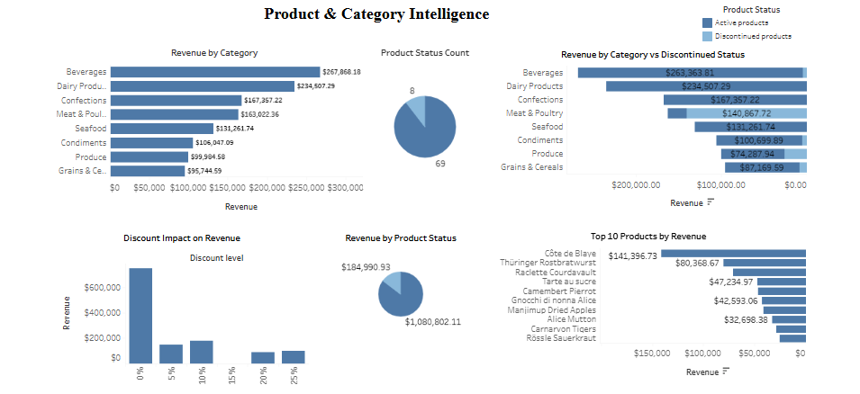
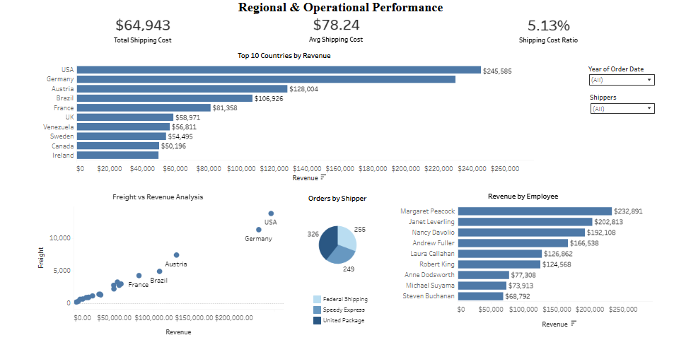

# Northwind Sales Dashboard — Technical Documentation

`Tableau` `Data Visualization` `Sales Analysis` `Operational Analytics`

For the business context and full findings, see the [main portfolio README](../../README.md#-northwind-sales-dashboard).

🔗 **[View the live interactive dashboard on Tableau Public](https://public.tableau.com/app/profile/zeenat.hamzat/viz/NorthwindTradersAnalysis_17774837434960/Dashboard1)**

## Dataset

The classic Northwind Traders transactional dataset, covering orders, order details, products, categories, employees, shippers, and customers across multiple countries.

## Approach

The analysis was structured around three lenses: sales/revenue performance, product/category intelligence, and regional/operational performance — moving from "what happened" to "what's driving it" rather than stopping at simple totals.

### 1. Sales & Revenue Overview

- Calculated total revenue ($1,265,793), total orders (830), and average order value ($1,525) to establish a baseline understanding of transaction size and volume.
- Built a revenue-over-time view to identify trend direction, alongside an order-volume-over-time view to check whether growth was driven by pricing, activity, or both.
- Broke down revenue by product category to identify concentration — Beverages and Dairy Products led, followed by Confections and Meat & Poultry.

### 2. Product & Category Intelligence

- Compared revenue contribution from active vs. discontinued products, confirming the current portfolio (active products) drives the overwhelming majority of revenue.
- Analyzed revenue by discount level to test whether discounting drives volume. Found that revenue was actually highest at 0% discount, with no clear linear relationship between discount depth and revenue — informing a pricing strategy recommendation.
- Identified top-performing individual products within categories, showing revenue concentration extends down to the product level, not just the category level.

### 3. Regional & Operational Performance

- Broke down revenue by country, identifying the USA and Germany as clear leaders, followed by Austria, Brazil, and France.
- Calculated total and average shipping cost ($64,943 total, $78.24 average per order) and computed a shipping-cost-to-revenue ratio (~5.13%) to assess logistics efficiency independent of scale.
- Analyzed the relationship between freight cost and revenue by country, finding a consistent ratio even as higher-revenue countries incurred proportionally higher shipping costs — indicating shipping efficiency is maintained at scale.
- Analyzed revenue by employee and by shipping carrier, both showing concentration among a small number of top contributors — a diversification consideration for operational risk.

## Key Design Decisions

- Framed the discount analysis around **revenue by discount tier rather than assuming discounts help** — testing the underlying assumption directly, rather than treating discounting as an unquestioned lever, which uncovered a genuine pricing-strategy insight.
- Used a **cost ratio (shipping cost ÷ revenue)** rather than a raw shipping cost figure, so operational efficiency could be judged independent of overall scale — this is what revealed that shipping efficiency holds steady even as revenue grows.
- Looked at concentration at **multiple levels** (category, product, country, employee, carrier) rather than just one, since revenue concentration risk can exist independently at each level.

## Files in This Folder
- `northwind-traders-analysis.twbx` — full Tableau packaged workbook
- `northwind-traders-dataset.xlsx` — source dataset
- `northwind-dataset-analysis-report.pdf` — full written analysis and findings

⬅️ [Back to main portfolio](../../README.md)
