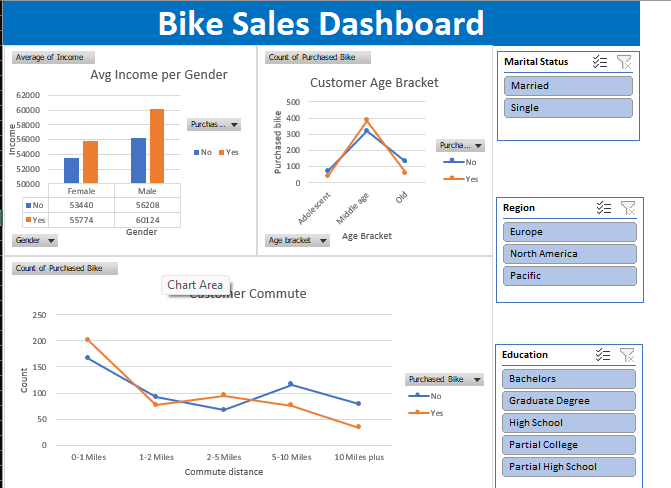
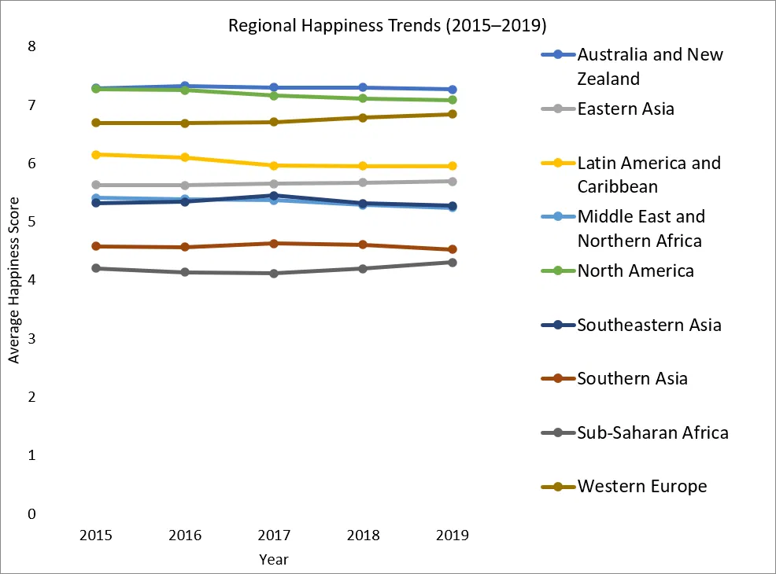
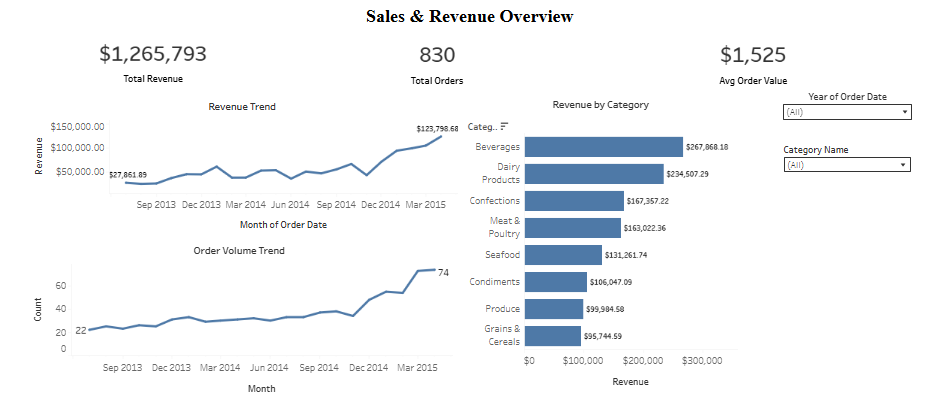
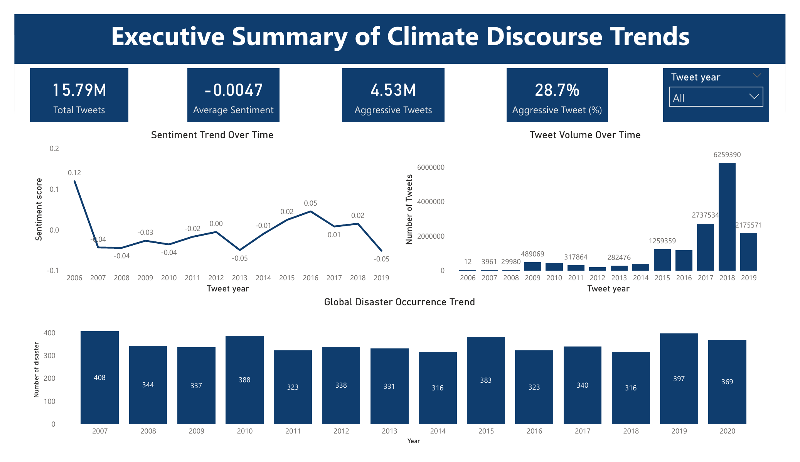

# Hi, I'm Zeenat Hamzat 👋

Data Analyst passionate about using data to solve real-world business problems. I enjoy transforming raw data into meaningful insights through data cleaning, exploratory analysis, dashboard development, and data storytelling.

This portfolio showcases projects across Excel, SQL, and BI tools where I analyzed data, built dashboards, and generated insights to support decision-making in business, social, and public sector contexts. Each project below includes the full business story — problem, approach, findings, and value — with a link to the technical documentation for anyone who wants to verify the methodology.

📫 zeenatolawumi@gmail.com | 💼 [LinkedIn](add)

---

## 📊 Excel Projects

### 🚴 Bike Sales Dashboard

**Business Problem**
A retail business wanted to understand which customers were most likely to purchase a bicycle, so they could target marketing more effectively instead of running broad, unfocused campaigns.

**What I Did**
Built an interactive Excel dashboard using PivotTables and PivotCharts to analyze customer income, occupation, commute distance, and age against purchase behavior, with slicers to explore different customer segments.

**What I Found**
Higher-income customers, especially in Professional and Skilled Manual occupations, and those living within 0–1 miles of the store were far more likely to buy. Middle-aged customers also purchased at higher rates than younger or older groups.

**Business Value**
This gives the marketing team a clear, data-backed customer profile to prioritize — rather than guessing who to target.

➡️ [Technical Documentation](./Excel-Projects/Bike-Sales-Dashboard/README.md) *(pivot table setup, data structure, full methodology)*

---

### 🌍 World Happiness Analysis

**Business Problem**
Understanding what drives national well-being helps governments, NGOs, and policymakers prioritize where to invest — economically or socially — to improve quality of life. This project asked: how has global happiness changed between 2015–2019, which regions are happiest, and what factors actually influence happiness scores?

**What I Did**
Consolidated five years of World Happiness Report data (originally spread across multiple sheets with inconsistent formatting) into a single clean dataset, then analyzed trends by region and correlated happiness scores against GDP per capita, social support, life expectancy, and freedom.

**What I Found**
Global happiness stayed relatively stable from 2015–2019. Australia & New Zealand and North America consistently ranked highest, while Sub-Saharan Africa consistently ranked lowest — a persistent regional gap. Higher GDP per capita, stronger social support, and better health outcomes were all associated with higher happiness scores.

**Business Value**
This gives policymakers or researchers an evidence-based view of which levers (economic vs. social vs. health) are most associated with well-being, and highlights which regions show the widest gaps and may need the most support.

➡️ [Technical Documentation](./Excel-Projects/World-Happiness-Analysis/README.md) *(data cleaning steps, methodology, limitations)*

---

### 📦 Marketing Data Cleaning & Title Optimization

**Business Problem**
A raw e-commerce product dataset (3,847 products) had missing values, duplicate records, inconsistent formatting, and overly long, unstructured product titles — all of which hurt both data usability and how easily products could be found via search (SEO).

**What I Did**
Using Excel formulas, I cleaned the dataset with a tailored strategy for each column type — filling missing categorical data with the mode, missing numeric data with a category-based average, and missing text fields with clear contextual placeholders. I also engineered a new `short_title` field, condensing lengthy product titles down to 30–50 characters while preserving the product name, type, and key attributes, to improve SEO readability.

**What I Found**
- **217 duplicate records** were identified and removed.
- The `description` field was missing in ~56% of rows and `bullet_point` in ~39% — too significant to drop, so both were handled with placeholder text rather than discarded.
- Product titles were often long and cluttered — condensed to concise, readable short titles (e.g. *"Tulip Flowers Blackout Curtain for Door, 2 pcs"*) without losing key product identity.

**Business Value**
A clean, standardized dataset ready for downstream analysis or marketing use, plus SEO-optimized short titles that could directly improve product discoverability and click-through rates in a real e-commerce search context.

➡️ [Technical Documentation](./Excel-Projects/Marketing-Data-Cleaning/README.md) *(formulas, methodology, before/after examples)*

---

## 🗄️ SQL Projects

### 🗄️ Employee Layoff Data Cleaning

**Business Problem**
Raw layoffs data pulled from public sources is rarely analysis-ready — it typically contains duplicate records, inconsistent formatting, and missing values that would skew any downstream analysis if left untouched. This project prepared a global tech layoffs dataset for reliable analysis (feeding directly into the Employee Layoff EDA project).

**What I Did**
Using MySQL, I built a staging-table workflow to safely clean the raw data — removing exact duplicates, standardizing inconsistent text values (e.g. multiple spellings of "Crypto" under industry), fixing date formatting, and handling missing values without discarding usable data.

**What I Found**
The raw dataset had duplicate rows undetectable by a simple `SELECT DISTINCT` (differences only showed up when checked across all columns together), inconsistent country/industry naming, and several rows missing an industry value that could be recovered from other rows for the same company.

**Business Value**
A clean, standardized dataset that any analyst can build accurate reports and visualizations from — without duplicate-inflated counts or missed matches due to inconsistent naming.

➡️ [Technical Documentation](./SQL-Projects/Employee-Layoff-Data-Cleaning/README.md) *(full SQL workflow and logic)*

---

### 🗄️ Employee Layoff EDA

**Business Problem**
Once the layoffs dataset was cleaned, the next question was: what does this data actually reveal about the global tech layoff wave from 2020–2023? This project explored the cleaned dataset to surface the biggest events, industry and geographic patterns, time trends, and which companies and sectors were hit hardest — and when.

**What I Did**
Using MySQL, I ran a progression of queries — from basic exploration to window functions, rolling aggregations, and ranked CTEs — to uncover patterns across company, industry, country, funding stage, and time.

**What I Found**

*Scale and severity*
- The dataset spans **March 2020 to March 2023** and covers **1,628 companies** across **51 countries** and **31 industries**, totaling **383,159 layoffs**.
- Google's 2023 layoff of 12,000 was the single largest event — but only 6% of their workforce, while Amazon's cumulative total across multiple rounds (18,150) was actually the highest of any company overall.
- **116 companies laid off 100% of their staff.** Several were extremely well-funded before collapsing entirely, including Britishvolt ($2.4B raised), Quibi ($1.8B raised), and Katerra ($1.6B raised) — funding size did not prevent total shutdown.
- On average, **Seed-stage companies cut ~70% of their workforce** when they had layoffs, versus only **~14% for Post-IPO companies** — early-stage companies make far more drastic, often existential cuts, even though large companies account for more total layoffs by volume (Post-IPO: 204,132 total).

*Timing*
- Two distinct waves emerge: a sharp initial spike in **April–May 2020** (the immediate pandemic shock), followed by a much larger, sustained climb starting mid-2022 through early 2023.
- **January 2023 alone accounted for 84,714 layoffs** — more than triple any other single month, and nearly matching all of 2020 combined.
- 2022 was the worst full year overall (160,661), but 2023's first quarter alone (125,677) came close to matching it.

*Geography and industry*
- The **United States accounts for 256,559 layoffs** — over 7x India's total (35,993), the next-highest country.
- Globally, **Consumer (45,182)** and **Retail (43,613)** were hit hardest overall — but this pattern doesn't hold everywhere. Country-level analysis showed India was hit hardest in Education, Netherlands in Healthcare, Brazil in Finance, and Singapore in Crypto — the "hardest hit" sector varies significantly by country rather than following one global trend.
- In 2020 specifically, Transportation and Travel were hit hardest (direct pandemic impact); this shifted toward Consumer/Retail/Tech-adjacent sectors by 2022–2023.

*Company rankings by year*
- The top company for layoffs changed every year: Uber (2020), Bytedance (2021), Meta (2022), Google (2023) — showing the crisis moved through different companies over time rather than being one continuous story.

**Business Value**
This analysis distinguishes between different kinds of impact — biggest single event vs. highest cumulative total vs. most severe proportional cut — and shows that global patterns (like "Consumer was hit hardest") can mask very different regional and stage-specific stories. That kind of nuance is useful for investors, analysts, or job seekers trying to understand risk by company stage, industry, or geography rather than relying on headline totals alone.

➡️ [Technical Documentation](./SQL-Projects/Employee-Layoff-EDA/README.md) *(full SQL workflow and logic)*

---

### 🛒 TradeZone Sales Analysis

**Business Problem**
TradeZone (an e-commerce platform) needed a full performance review of 2023–2024 for its Head of Growth and Head of Seller Operations — covering revenue trends, customer behavior, product performance, and seller efficiency — to identify growth drivers and risks ahead of strategic planning.

**What I Did**
Using PostgreSQL, I first ran a full data quality audit across all six tables (customers, sellers, products, orders, order_items, payments, reviews) — checking for missing values, duplicates, and inconsistent formatting — then applied targeted, justified fixes for each issue (e.g. category-level price imputation, standardized city names). I then wrote 8 analytical queries covering customer acquisition, product performance, seller fulfilment, quarterly trends, spend segmentation, payment preferences, and rating impact, and delivered the findings as a stakeholder memo with concrete recommendations.

**What I Found**
- **Revenue grew strongly through 2023–2024, with Q4 growth of ~₦290M** over the prior year — driven mainly by order volume rather than higher average order value, suggesting a seasonal/peak-period dependency worth planning around.
- **High spenders account for over 95% of 2024 revenue**, with just 600+ customers driving the vast majority of earnings — a concentration risk if that segment churns.
- **All top 10 revenue-generating products are Electronics**, and mid-rated products actually outperformed highly-rated ones in total revenue — suggesting price and necessity drive purchases more than review scores.

**Business Value**
Delivered as an executive memo with two concrete, owned recommendations: diversifying revenue beyond Electronics (Head of Growth), and investigating conversion issues in underperforming states like Oyo and Kano (Head of Seller Operations) — each with a defined 60–90 day expected outcome. The memo also transparently flagged data quality caveats (imputed prices, order-total discrepancies) so stakeholders could weigh the findings appropriately.

➡️ [Technical Documentation](./SQL-Projects/TradeZone-Sales-Analysis/README.md) *(data cleaning methodology, all 8 queries, and full analyst memo)*

---

## 📈 BI Projects

### 📈 Northwind Sales Dashboard

**Business Problem**
Northwind Traders needed to understand what was actually driving revenue — not just totals, but the underlying patterns across time, product categories, geography, and logistics — to inform where to focus growth efforts and where risk was concentrated.

**What I Did**
Built an interactive Tableau dashboard analyzing sales, product, regional, and operational data, moving beyond simple totals to examine trends over time, product/category performance, discount impact, regional concentration, and shipping efficiency.

**What I Found**
- Total revenue was **$1,265,793 across 830 orders**, averaging **$1,525 per order** — a business model built on higher-value transactions rather than high volume.
- Revenue and order volume both trended upward over the period, suggesting genuine, activity-driven growth rather than just price increases.
- **Beverages and Dairy Products led all categories**, with Confections and Meat & Poultry close behind — revenue is concentrated in a few key categories.
- **Discounting did not meaningfully increase revenue** — the highest revenue actually occurred at 0% discount, suggesting margin-eroding discounts weren't being offset by higher sales volume.
- **USA and Germany were the top markets** ($245,585 and close behind, respectively), followed by Austria ($128,004), Brazil ($106,926), and France ($81,358) — a concentrated but genuinely international customer base.
- At the product level, **Côte de Blaye alone generated $141,396.73** — nearly double the next highest product — showing revenue concentration extends down to individual SKUs, not just categories.
- Shipping costs totaled **$64,943** (~5.13% of revenue) — a well-controlled logistics cost ratio that held steady even as regional revenue scaled up.
- Revenue was also concentrated at the **employee and shipping-carrier level** — a small number of top performers and one dominant carrier handled a disproportionate share of activity.

**Business Value**
The analysis surfaced both a growth opportunity (expand high-performing markets and diversify product/employee/carrier concentration to reduce risk) and a margin opportunity (rethink broad discounting in favor of more targeted pricing) — giving leadership concrete, data-backed priorities rather than guesswork.

🔗 [Live Interactive Dashboard (Tableau Public)](https://public.tableau.com/app/profile/zeenat.hamzat/viz/NorthwindTradersAnalysis_17774837434960/Dashboard1)

➡️ [Technical Documentation](./BI-Projects/Northwind-Sales-Dashboard/README.md) *(dataset, build approach, full findings)*

---

### 🌡️ Climate Change Twitter Analysis

**Business Problem**
A climate research organisation wanted to understand how public opinion on climate change has evolved over time, and to identify which topics, locations, and discussion styles are associated with the most active, divisive, or aggressive engagement.

**What I Did**
Ran a full end-to-end analytics workflow: ingested 15.79 million tweets into PostgreSQL, performed data quality checks and cleaning, built a set of reusable analytical views (sentiment trends, stance trends, topic/aggression breakdowns, geographic sentiment), then built a 4-page interactive Power BI dashboard to explore the results. A supporting global disaster dataset was layered in by year to compare online discourse against real-world climate events.

**What I Found**
- The dataset spans **2006–2019** (not 2008–2022 as originally stated in the task) — caught this discrepancy directly through SQL exploration rather than assuming the task description was accurate.
- **Tweet volume grew dramatically over time**, peaking in 2018, while average sentiment stayed only slightly negative overall — suggesting climate discourse is mixed rather than uniformly hostile.
- **Believers dominate the conversation (71.5%)**, with neutral tweets at 20.9% and deniers just 7.5% — but denial is still present across nearly every topic.
- **28.7% of all tweets were flagged as aggressive** — a meaningful share of confrontational discourse, concentrated more heavily in certain topics like Politics and "Donald Trump versus Science."
- **Tweet volume grew steadily while global disaster occurrence stayed relatively flat** — indicating the rise in climate discourse is driven more by public awareness and media attention than by an actual increase in climate disasters.
- Only about **5.3 million of 15.7 million tweets had usable location data**, so geographic analysis, while informative, represents a subset of the full conversation.

**Business Value**
Gives a climate communications team a data-backed view of where to focus outreach (high-volume, high-attention topics), where to expect friction (topics with elevated aggression), and who to prioritize persuading (the large neutral segment, which may be more reachable than committed deniers) — rather than treating all climate discourse as one undifferentiated mass.

➡️ [Technical Documentation](./BI-Projects/Climate-Change-Twitter-Analysis/README.md) *(PostgreSQL data pipeline, views, and full dashboard breakdown)*

---

### 🇳🇬 Nigeria Budget Storytelling
*(Coming soon — in progress with team)*

---

## 🛠️ Tools & Skills

`Excel` `SQL` `MySQL` `PostgreSQL` `Power BI` `Tableau` `PivotTables` `Window Functions` `CTEs` `Data Cleaning` `Data Visualization` `Stakeholder Reporting` `Storytelling`
